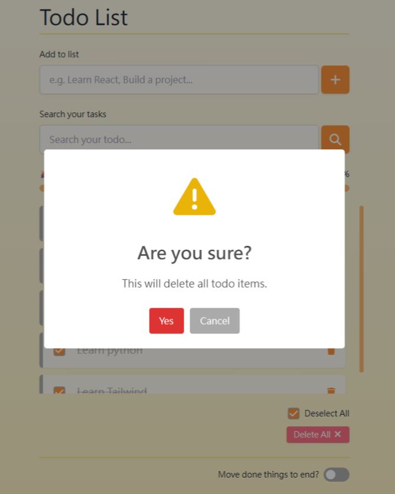

# Nina's Todo List

這是Todo List 專案，使用 React + Tailwind CSS 打造，具備以下功能：

1.  輸入框：新增待辦事項
2.  勾選框：勾選完成／未完成（文字加上刪除線）
3.  刪除鈕：支援單筆刪除
4.  滾動條：自動捲動至最底
5.  進度條：顯示已完成比例（百分比 + emoji）
6.  切換鈕：切換完成項目是否排序在最下方
7.  群組操作：全選 / 取消全選 / 清除全部
8.  localStorage 暫存：頁面重新整理不會遺失資料
9.  視覺提示：完成項目左側裝飾條變色
10. 空清單提示（Empty State）：當沒有待辦事項時會顯示提示訊息
11. 刪除全部前提示（SweetAlert）：按下刪除全部會跳出確認提示視窗
12. 關鍵字搜尋：篩選項目內容
13. 項目動畫：新增與刪除帶有動畫（zoom-in / fade-out）

## 🔧 使用技術

- React 18 (Function Components + Hooks)
- Tailwind CSS (RWD樣式及動畫)
- FontAwesome (icon 呈現)
- SweetAlert2（確認刪除提示）
- Git & GitHub (版本管理)
- localStorage（前端資料暫存）

📸 畫面預覽

### 初始畫面

### 已勾選項目

### SweetAlert 提示

📝 備註
目前專案已具備完整的待辦清單核心功能。
未來預計：

- 強化響應式體驗，讓不同尺寸裝置都有良好操作感
- 提升搜尋欄互動性，包含清除功能、關鍵字高亮等互動細節
- 支援使用者編輯已新增的待辦項目內容，提升操作彈性

  更新將持續同步於 GitHub。

## 聯絡方式

若您對本專案有任何問題，或希望進一步了解我的作品與經歷，歡迎透過以下方式聯絡我：

- Email ： ninaaaaa1327@gmail.com
- 作品集： https://isnina47.github.io/About_Nina/
