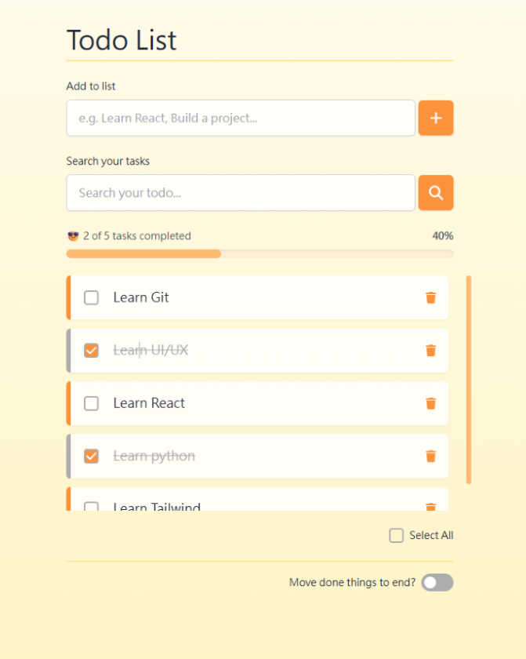

# Nina's React Todo List

這是一個使用 React Hooks（Function Component）實作的 Todo List 專案，具備以下功能：

1.  輸入框：新增待辦事項
2.  勾選框：勾選完成／未完成（文字加上刪除線）
3.  刪除鈕：刪除事項
4.  滾動條：自動捲動至最底
5.  進度條：顯示完成進度條（整數百分比）
6.  切換鈕：切換完成項目是否顯示在下方
7.  群組操作：全選 / 取消全選 / 清除全部
8.  支援 localStorage 暫存（重新整理不會遺失）
9.  項目完成時提供視覺提示：左側裝飾條顏色變化
10. 空清單提示（Empty State）：當沒有待辦事項時會顯示提示訊息
11. 刪除全部前提示（SweetAlert）：按下刪除全部會跳出確認提示視窗

## 🔧 使用技術

- React 18
- Function Components + Hooks（useState、useEffect）
- Tailwind CSS
- SweetAlert2（確認刪除提示）
- Git & GitHub

## 🚀 專案啟動方式

安裝專案所需套件
npm install

啟動本地開發伺服器
npm start

📸 畫面預覽

###  初始畫面

###  已勾選項目

###  SweetAlert 提示

📝 備註
本專案為面試展示用，包含基本功能與 UX 強化設計。  
其中 Delete All 按鈕使用 SweetAlert 進行二次確認，提升操作安全與使用體驗。
